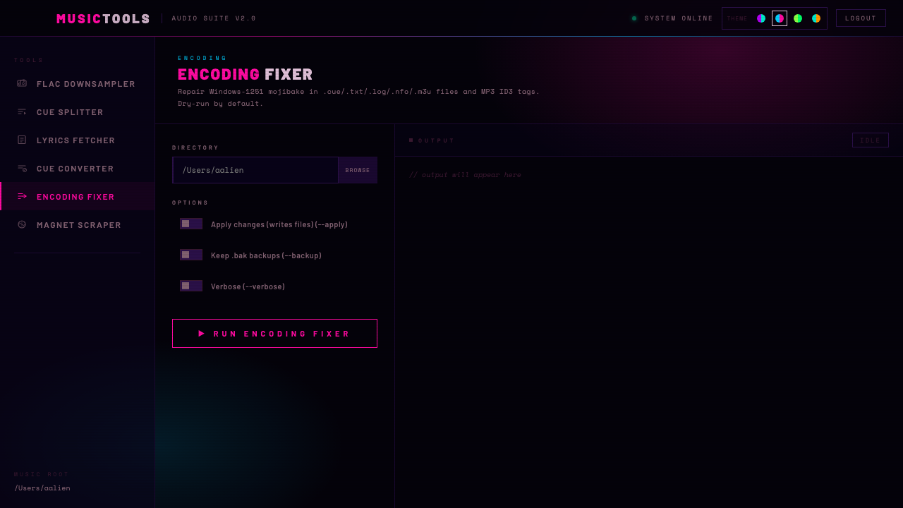

# Music Tools

A cyberpunk-themed macOS desktop app for audio processing. Wraps a suite of FLAC, CUE, encoding, and lyrics scripts in a native Electron GUI with real-time streaming output.



---

## Tools

| Tool | What it does |
|---|---|
| **FLAC Downsampler** | Converts hi-res FLAC to 44.1 kHz / 16-bit using ffmpeg + SoXR resampler |
| **CUE Splitter** | Splits single-file FLAC+CUE albums into individual tracks — full Unicode / Cyrillic support |
| **Lyrics Fetcher** | Fetches synced (.lrc) or plain lyrics for FLAC, MP3 and M4A via LRCLIB, ChartLyrics, lyrics.ovh |
| **CUE Converter** | Auto-detects encoding of .cue files and converts to UTF-8 (Windows-1251, KOI8-R, ISO-8859-5, ...) |
| **Encoding Fixer** | Repairs Windows-1251 mojibake in .cue/.txt/.log/.nfo/.m3u files and MP3 ID3 tags. Dry-run by default |
| **Magnet Scraper** | Extracts magnet links from RuTracker topic URLs |

---

## Requirements

- macOS 10.12+
- [Node.js](https://nodejs.org/) 18+
- [ffmpeg](https://ffmpeg.org/) (with SoXR support) — `brew install ffmpeg`
- Perl — `brew install perl`
- Python 3 — `brew install python3`
- `uchardet` + `iconv` — for CUE Converter: `brew install uchardet`

Python dependencies (for Lyrics Fetcher and Encoding Fixer):

```bash
pip3 install mutagen requests charset-normalizer
```

---

## Run in development

```bash
npm install
npm start          # starts Express server on :3000
open http://localhost:3000
```

Or as a native window:

```bash
npm run electron
```

Set a custom music root (defaults to your home directory):

```bash
MUSIC_ROOT=/Volumes/Music npm start
```

---

## Build

Produces signed or unsigned DMGs for both Apple Silicon and Intel:

```bash
npm run build
# dist/Music Tools-1.0.0-arm64.dmg  — Apple Silicon
# dist/Music Tools-1.0.0.dmg        — Intel x64
```

---

## CLI scripts

All scripts can be used standalone without the GUI.

**Split CUE album:**
```bash
./split-cue-unicode.pl --to-root --delete --dry-run /path/to/album
./split-cue-unicode.pl --to-root --delete /path/to/album
```

**Downsample FLAC to CD quality:**
```bash
./flac_downsampler.sh /path/to/hires /path/to/output
```

**Fetch lyrics:**
```bash
python3 audio_lyrics_fetcher.py /path/to/album
```

**Convert CUE encoding to UTF-8:**
```bash
./cue_converter.sh /path/to/album
```

**Fix mojibake encoding:**
```bash
python3 encoding_fixer.py /path/to/album            # dry-run preview
python3 encoding_fixer.py /path/to/album --apply    # write changes
python3 encoding_fixer.py /path/to/album --apply --backup --verbose
```

---

## Project structure

```
split-cue-unicode.pl      # CUE splitter (Perl)
flac_downsampler.sh       # FLAC downsampler (bash + ffmpeg)
flac_to_cd.sh             # Recursive FLAC converter preserving directory structure
audio_lyrics_fetcher.py   # Lyrics fetcher (Python)
cue_converter.sh          # CUE encoding converter (bash + uchardet)
encoding_fixer.py         # Mojibake repair tool (Python)
rutracker_scraper.py      # RuTracker magnet scraper (Python)
server.js                 # Express backend — job management + SSE streaming
electron-main.js          # Electron shell
index.html                # Single-page frontend
```

---

## License

MIT
